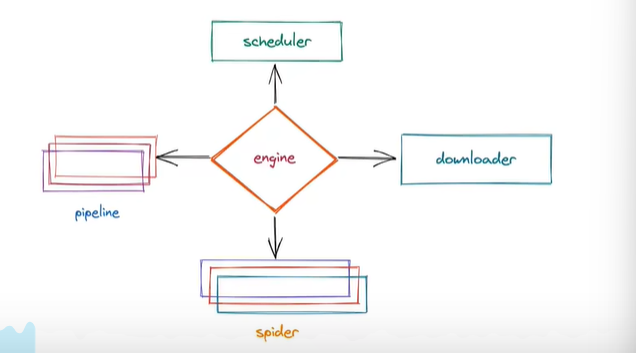

##### 爬虫逻辑

原始爬虫:

url_lst  > request > response > data

​		response > url_lst > ...

##### scrapy 逻辑



1.引擎

2.spider

3.scheduler 

​	管道可以几个，通过优先级来指定先通过哪个管道，数字越小，优先级越高

4.downloader

5.pipeline


##### 新建项目

scrapy strartproject game

cd game

scrapy genspider example example.com


##### 日志等级

LOG_LEVEL = "WARNING"  > 可以在settings.py里面去设置


##### 响应解析

记得extract()返回列表

extract_first()返回一个数据

yield返回数据 把数据交给pipeline来进行持久化存储

记得在pipeline中return 才能给到下一个管道

```python
def parse(self,response,**kwargs): #是重写的父类的方法
    pass
```


##### pipeline

管道是默认关闭的，需要手动开启

yield只能是request，item，or None ,其实也可以是字典,建议别这么做

**建议先定义item**

```python
class CaipiaoItem(scrapy.Item):
    qihao = scrapy.Field() # 相当于字典里的key
    red_ball = scrapy.Field()
    blue_ball = scrapy.Field()
```

```python
# shuangseqiu.py

from caipiao.items import CaipiaoItem #先导包
red_ball = 3
cai = CaipiaoItem() # cai = dict()
cai['red_ball'] = red_ball
```

```python
# pipeline.py
class CaipiaoPipeline:
    def open_spider(self,spider): # 爬虫程序开始运行的时候执行
        pass
    def process_spider(self,spider):# 每一次yield数据回来的时候都会执行
        pass
    def close_spider(self,spider): #爬虫程序结束的时候执行
```


##### 封装请求

```python
def parse(self,resp,**kwargs):
    href = '/xxx/xxx.html'
    yield scrapy.Request(
        url=resp.urljoin(herf) # 可以直接跟resp进行拼接,
        method='get',
        callback=self.parse_detail
    )

def parse_detail(self,resp,**kwargs):
    pass
```


**利用图片管道进行图片下载**

```python
# pipeline.py
from scrapy.pipeline.images import ImagesPipeline

#想要使用ImagesPipeline 必须单独设置一个配置 用来保存文件的文件夹
#在settings里面 添加IMAGE_STORE = "XXX" > 指定一个存图片的文件夹
class ImgDoneloadPipeline(ImagesPipeline):
    
    def get_media_requests(self,item,info): # 下载
        return scrapy.Request(item['img_src']) #这里是直接把一个请求 返回给Image管道 
    
    def file_path(self,request,response=None,info=None): #文件路径
        filename = request.url.split("/")[-1] #request.url可以直接获取到刚刚请求的url地址
        return f"img/{filename}" 
        
    def item_completed(self,results,item,info): #返回文件的详细信息
        print(results)
        return item    #这里记得return给下个管道
```


